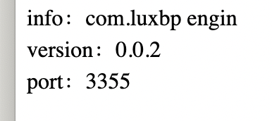
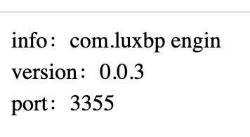
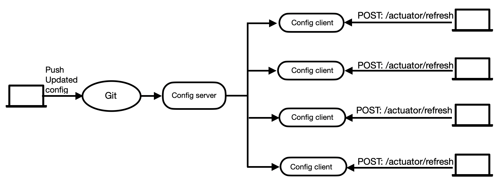

### 10.1 Manually fresh using actuator

In order to solve the problem that the latest configuration cannot be obtained without restarting the Config client, next, we will modify micro-service-cloud-config-client-3355, and the modification steps are as follows.

### (1) Add the following dependencies to the pom.xml of micro-service-cloud-config-client-3355, and introduce the Spring Boot actuator monitoring module.

```xml
<dependency>
    <groupId>org.springframework.boot</groupId>
    <artifactId>spring-boot-starter-actuator</artifactId>
</dependency>
```

### (2) Add the following configuration in the configuration file bootstrap.yml to expose the monitoring nodes of Spring Boot actuator to the outside world.

```yaml
# Spring Boot 2.50 screens most of the nodes for actuator monitoring, and only exposes the health node. The configuration (*) in this section is to enable all nodes
management:
  endpoints:
    web:
      exposure:
        include: "*"   # * is a keyword in the yaml file, so quotation marks are required
```

### (3) Use the @RefreshScope annotation on the ConfigClientController class to enable configuration refresh. The code is as follows

```java
package com.luxbp.controller;

import org.springframework.beans.factory.annotation.Value;
import org.springframework.cloud.context.config.annotation.RefreshScope;
import org.springframework.web.bind.annotation.GetMapping;
import org.springframework.web.bind.annotation.RestController;

//Read the content of the specified configuration file in the configuration center and display it on the page
@RefreshScope //In order to get the latest git configuration dynamically (manually), add the actuator to monitor and load RefreshScope,
@RestController
public class ConfigClientController {
    @Value("${server.port}")
    private String serverPort;
    @Value("${config.info}")
    private String configInfo;
    @Value("${config.version}")
    private String configVersion;
    @GetMapping(value = "/getConfig")
    public String getConfig() {
        return "info：" + configInfo + "<br/>version：" + configVersion + "<br/>port：" + serverPort;
    }
}
```

### (4) Restart micro-service-cloud-config-client-3355, and then modify the config.version in the configuration file config-dev.yml to 3.0, the configuration is as follows.

```yaml
config:
  info: com.luxbp engin
  version: 0.0.3
```

### (5) Use the browser to access "<http://localhost:3355/getConfig>" again, and the result is as shown in the figure below.



As can be seen from the above figure, even if we modify the Spring Cloud Config client, we still cannot directly obtain the latest configuration.

The reason is that we have not notified the actuator monitoring module to refresh the configuration. The code in this section is no different from the code in the previous section. In terms of architecture, the main difference is that we have added an actuator in this part. The so-called manual refresh means that we send a message to the actuator integrated in the client, and let the actuator notify the client to pull information. It should be noted that if there are multiple clients, you need to send messages to the actuators of each client separately.

### (6) Open the command line window, use the following command to send a POST request to refresh the Spring Cloud Config 3355 client, and notify the client that the configuration file has been modified and the configuration needs to be pulled again.

```sh
curl -X POST "http://localhost:3355/actuator/refresh"
```

### (7) Use the browser to visit "<http://localhost:3355/getConfig>" again, and the result is as shown in the figure below.



### 10.1 Problems in manually refresh

In the above example, we introduced the Spring Boot actuator monitoring component in the Config client (port number: 3355). This allows us to obtain the latest configuration without restarting the Config client, as shown in the figure below.



Although this method solves the problem of restarting the Config client to obtain the latest configuration, another problem arises, that is, as long as the configuration in the configuration warehouse changes, we need to manually send POST requests to the Config client one by one. , to notify them to re-pull the configuration.

We know that the so-called Config client is actually a service one by one. In the microservice architecture, a system often contains dozens or even dozens of services. It is obviously unreasonable to send POST requests to dozens of microservices because of the modification of a certain configuration file.

So we need a way to "notify once, take effect everywhere” The solution is Spring Cloud Config cooperates with Bus to realize dynamic refresh of configuration. Continue reading next notes.