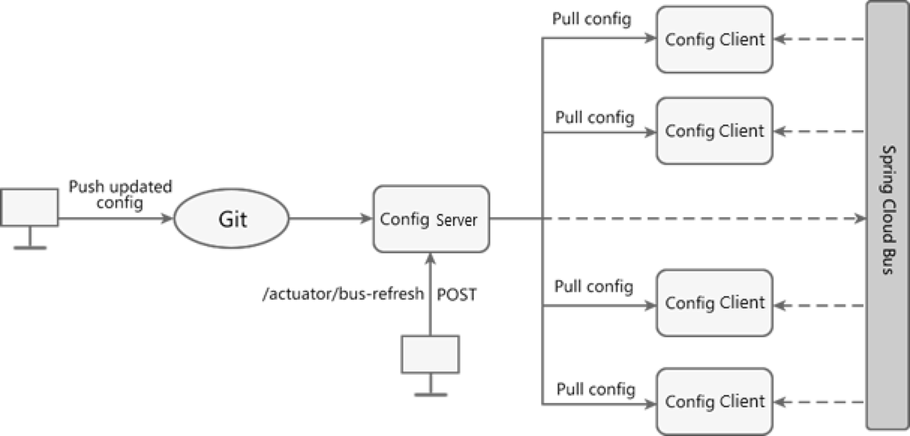

### 11.1 Dynamic refresh by using Config+Bus

Spring Cloud Bus is also known as the message bus. It can connect various services in the microservice architecture through lightweight message brokers (such as RabbitMQ, Kafka, etc.), and realize broadcast status changes, event push and other functions. It can also realize Communication functions between microservices.

Currently Spring Cloud Bus supports two message brokers: RabbitMQ and Kafka.

Spring Cloud Bus will use a lightweight message broker to build a public message topic Topic (the default is "springCloudBus"), and messages in this Topic will be monitored and consumed by all service instances. When one of the services refreshes the data, Spring Cloud Bus will save the information to the Topic, so that the service listening to this Topic will receive the message and consume it automatically.

Many functions can be realized by using the special mechanism of Spring Cloud Bus, and the dynamic refresh of configuration with Spring Cloud Config is one of the most typical application scenarios.

When the configuration in the Git repository changes, we only need to send a POST request to a certain service, and Spring Cloud Bus can notify other services to re-pull through the message proxy. Get the latest configuration to realize the dynamic refresh of the configuration.

The following picture shows how it works:



According to picture, using Spring Cloud Bus to implement dynamic configuration refresh requires the following steps:

(i) When the configuration in the Git warehouse changes, the operation and maintenance personnel send a POST request to the Config server, and the request path is "/actuator/refresh".

(ii) After receiving the request, the Config server will forward the request to the service bus Spring Cloud Bus.

(iii) After Spring Cloud Bus receives the message, it will notify all Config clients.

(iv) The Config client receives the notification and requests the Config server to pull the latest configuration.

(v) All Config clients get the latest configuration.

Let's take RabbitMQ as an example to demonstrate how to use Config+Bus to implement dynamic configuration refresh.

### (1) In pom.xml of micro-service-cloud-config-center-3344, add Spring Boot actuator monitoring module and Spring Cloud Bus dependencies, the code is as follows.

```xml
<!--add spring cloud message Bus support for RabbitMQ-->
<dependency>
    <groupId>org.springframework.cloud</groupId>
    <artifactId>spring-cloud-starter-bus-amqp</artifactId>
</dependency>
<!--add Spring Boot actuator dependency-->
<dependency>
    <groupId>org.springframework.boot</groupId>
    <artifactId>spring-boot-starter-actuator</artifactId>
</dependency>
```

### (2) In the configuration file application.yml of micro-service-cloud-config-center-3344, add the relevant configuration of RabbitMQ and Spring Boot actuator, the configuration content is as follows.

```yaml
##### RabbitMQ related configuration, 15672 is the port of the web management interface, 5672 is the access port of MQ###########
##### By default, rabbitmq only have one built-in user, which is guest. But guest user can only be used on localhost. So before we 
##### deloy on the actual server, we need to creat new user(such as admin) and then give it the access to vhost "/", see details in rabbit mq doc
spring:
  rabbitmq:
    host: 127.0.0.1
    port: 5672
    # username: guest
    username: admin
    # password: guest
    password: admin
# Spring Boot 2.50 shields most of the nodes for actuator monitoring, and only exposes the heath node. The configuration (*) in this section is to enable all nodes
management:
  endpoints:
    web:
      exposure:
        include: 'bus-refresh'
```

### (3) In the pom.xml of micro-service-cloud-config-client-3355, add the relevant dependencies of Spring Cloud Bus, the code is as follows.

```xml
<!--add spring cloud message Bus support for RabbitMQ-->
<dependency>
    <groupId>org.springframework.cloud</groupId>
    <artifactId>spring-cloud-starter-bus-amqp</artifactId>
</dependency>
```

### (4) Add the following configuration in the configuration file bootstrap.yml of micro-service-cloud-config-client-3355.

```yaml
spring: 
  rabbitmq:
    host: 127.0.0.1
    port: 5672
    # username: guest
    username: admin
    # password: guest
    password: admin
```

### (5) Referring to micro-service-cloud-config-client-3355, create a new Spring Boot module named micro-service-cloud-config-client-bus-3366 (port number is 3366), and in its configuration file bootstrap.yml Add the following configuration.

```yaml
#bootstrap.yml is at system level，loading order is prior to application.yml   Responsible for loading configuration from outside and parsing
server:
  port: 3366  #port num 3366
spring:
  application:
    name: spring-cloud-config-client-bus
  cloud:
    config:
      label: main #branch name
      name: config  #name of the config file, the 'config' in 'config-dev.yml'
      profile: dev  #environment name, 'dev'  'config-dev.yml'
      #don't forget to add http here. Otherwise it won't load.
      uri: http://localhost:3344 #address of Spring Cloud Config server end
  ##### RabbitMQ related configuration, 15672 is the port of the web management interface, 5672 is the access port of MQ###########
  rabbitmq:
    host: 127.0.0.1
    port: 5672
    username: admin
    password: admin
eureka:
  client:
    service-url:
      defaultZone: http://eureka7001.com:7001/eureka/,http://eureka7002.com:7002/eureka/,http://eureka7003.com:7003/eureka/
  instance:
    instance-id: config-bus-3366 #Custom service name information
# Spring Boot 2.50 screens most of the nodes for actuator monitoring, and only exposes the health node. The configuration (*) in this section is to enable all nodes
management:
  endpoints:
    web:
      exposure:
        include: "*"   # * is a keyword in the yaml file, so quotation marks are required
```

### (6) Restart microservice-cloud-config-center-3344 and microservice-cloud-config-client-3355 in turn, and use a browser to access "<http://localhost:3355/getConfig>” we will get config seccussfully

### (7) Start micro-service-cloud-config-client-bus-3366, use a browser to access "<http://localhost:3366/getConfig>", the result will be the same with step 6

### (8) Now, make some changes in the configuration file in GitHub

### (9) Open the command line window and use the following command to send a POST request to micro-service-cloud-config-center-3344 (Config Server) to refresh the configuration.

```sh
curl -X POST "http://localhost:3344/actuator/bus-refresh"
```

(10) Visit "<http://localhost:3355/getConfig>" again with a browser, now you should see the latest config that has been changed in step 8

(11) Visit "<http://localhost:3366/getConfig>"again with a browser, you’ll get the same result with step 10.


### 11.2 Fixed-point notification

The so-called fixed-point notification means that not all Config clients will be notified, but only one of the Config clients will be notified according to the needs.

The method of using Spring Cloud Bus to implement fixed-point notification is very simple, as long as we use the following format when sending POST requests.

```text
http://{hostname}:{port}/actuator/bus-refresh/{destination}
```

The parameters are described as follows:

* {hostname}: Indicates the host address of the Config server, which can be either a domain name or an IP address.
* {port}: indicates the port number of the Config server.
* {destination}: Indicates the Config client (microservice) that needs fixed-point notification, consisting of the service name (spring.application.name) + port number (server.port) of the Config client, for example, only micro-service-cloud-config is notified -client-3355 refresh configuration, the value is spring-cloud-config-client:3355.

Let's use a simple example to demonstrate the fixed-point notification of Spring Cloud Bus dynamic refresh.

### (1) make some changes again in the configuration file in GitHub

### (2) Open the command line window and use the following command to send a POST request to micro-service-cloud-config-center-3344 (Config Server) to refresh the configuration.

```sh
curl -X POST "http://localhost:3344/actuator/bus-refresh/spring-cloud-config-client:3355"
```

### (3) Visit "<http://localhost:3355/getConfig>" with a browser, you’ll see the config has already been changed.

### (4) Visit "<http://localhost:3366/getConfig>” with a browser, you’ll see the config remains unchanged.

