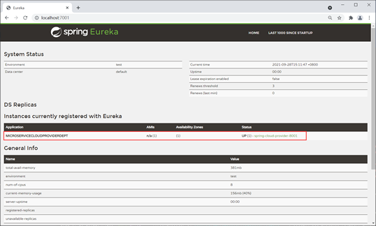

### 3.1 What does Eureka do

Now that we’ve decided to split big app into multiple microservices. Instead of calling method from different classes, we are nowing calling services from different microservices via http calling. This require us to remember a lot of address, and the corresponding services behind it.

With Eureka, we can register each microservices into Eureka. When calling services, we can fetch service from Eureka instead of fetching http address from our memory. In this way, we don’t have to memorize a lot address and service. And also the micorservices are not depending on each other. All microservices depend on Eureka.


### 3.2 Three types of roles in Eureka

Eureka adopts CS (Client/Server, client/server) pattern. Eureka Server is also known as Discover Server(The word Eureka comes from the ancient Greek word meaning "discovered”.) There can either be one server or a bunch of servers. Single server will work in standalone mode, multiple servers will work in cluster mode. As for Eureka client, it refers to the microservices. There are two types of Eureka Client(microservice): Provider and Consumer. Provider provide services, willing to expose the services, and will register its service to Discover Server. Consumer doesn't provide any Services but it consumes the service. It will fetch the service registered in Discover Server and perform an http call to call the service. Consumer doesn’t need to register itself to Discover Server.

There are also some microservices, they provide and consume service at the same time. That means he is provider and consumer at the same time. This kind of microserver should also register itself in Discover Server.

There are also some microservices, they don’t provide any service, nor consume any service. Usually these are some common modules which may be useful for all micorservice, for example, entity classes.

Thus there are three types of roles in Eureka: Discover Server(Eureka Server), Provider(Eureka Client), Consumer(Eureka Client).


### 3.3 Important Config in Eureka

For each microservice, we can config it as consumer or provider in application.yml

There are two configuration options. register-with-eureka and fetch-registry

Set register-with-eureka to true means register current microservice to Discover Server.

Set register-with-eureka to false means don't register current microservice to Discover Server.Usually, consumer and Eureka server itself don’t need to register in the Discover Server. By default, this option is true.

set fetch-registry to true means current microservice is fetching services from Discover Server

set fetch-registry to false means current microservice doesn’t need to fetch any services from Discover Server

Typically, a consumer should set register-with-eureka to false, set fetch-registry to true

a provider should either set both to true or at least set register-with-eureka to true

Discover itself should set both to false.


### 3.4 Set up Eureka in Spring Cloud

Since this case involves multiple microservices created by Spring Boot, for the convenience of management, here we use Maven's multi-module structure (that is, a project contains multiple modules) to build the project.

### (1) Create the main project(Maven Project)

Create a Maven main project named DataEngineSwarm, and then use dependencyManagement in the pom.xml of the main project to manage the version of Spring Cloud, as follows:

```xml
 <?xml version="1.0" encoding="UTF-8"?>
<project xmlns="http://maven.apache.org/POM/4.0.0"
         xmlns:xsi="http://www.w3.org/2001/XMLSchema-instance"
         xsi:schemaLocation="http://maven.apache.org/POM/4.0.0 http://maven.apache.org/xsd/maven-4.0.0.xsd">
    <modelVersion>4.0.0</modelVersion>
    <packaging>pom</packaging>
    <modules>
        <module>micro-service-cloud-api</module>
    </modules>
    <parent>
        <groupId>org.springframework.boot</groupId>
        <artifactId>spring-boot-starter-parent</artifactId>
        <version>2.3.6.RELEASE</version>
        <relativePath/> <!-- lookup parent from repository -->
    </parent>
    <groupId>com.luxbp</groupId>
    <artifactId>DataEngineSwarm</artifactId>
    <version>0.0.1-SNAPSHOT</version>
    <properties>
        <maven.compiler.source>8</maven.compiler.source>
        <maven.compiler.target>8</maven.compiler.target>
        <project.build.sourceEncoding>UTF-8</project.build.sourceEncoding>
        <maven.compiler.source>1.8</maven.compiler.source>
        <maven.compiler.target>1.8</maven.compiler.target>
        <junit.version>4.12</junit.version>
        <log4j.version>1.2.17</log4j.version>
        <lombok.version>1.16.18</lombok.version>
    </properties>
    <dependencyManagement>
        <dependencies>
            <!--Use dependencyManagement to declare the version of Spring Cloud in the main project, 
            so that when Spring Cloud component dependencies are introduced into the Module in the project, 
            there is no need to declare the version information of the components. Ensure the consistency of each component of Spring Cloud-->
            <dependency>
                <groupId>org.springframework.cloud</groupId>
                <artifactId>spring-cloud-dependencies</artifactId>
                <version>Hoxton.SR12</version>
                <type>pom</type>
                <scope>import</scope>
            </dependency>
        </dependencies>
    </dependencyManagement>
    <build>
        <finalName>microservicecloud</finalName>
        <resources>
            <resource>
                <directory>src/main/resources</directory>
                <filtering>true</filtering>
            </resource>
        </resources>
        <plugins>
            <plugin>
                <groupId>org.apache.maven.plugins</groupId>
                <artifactId>maven-resources-plugin</artifactId>
                <configuration>
                    <delimiters>
                        <delimit>$</delimit>
                    </delimiters>
                </configuration>
            </plugin>
        </plugins>
    </build>
</project>
```

### (2) Create a common submodule(Maven Module)

Under the main project, create a Maven Module named micro-service-cloud-api: micro-service-cloud-api, and its pom.xml configuration is as follows.

```xml
<?xml version="1.0" encoding="UTF-8"?>
<project xmlns="http://maven.apache.org/POM/4.0.0"
         xmlns:xsi="http://www.w3.org/2001/XMLSchema-instance"
         xsi:schemaLocation="http://maven.apache.org/POM/4.0.0 http://maven.apache.org/xsd/maven-4.0.0.xsd">
    <parent>
        <groupId>com.luxbp</groupId>
        <artifactId>DataEngineSwarm</artifactId>
        <version>0.0.1-SNAPSHOT</version>
    </parent>
    <modelVersion>4.0.0</modelVersion>
    <artifactId>micro-service-cloud-api</artifactId>
    <properties>
        <maven.compiler.source>8</maven.compiler.source>
        <maven.compiler.target>8</maven.compiler.target>
    </properties>
    <dependencies>
        <dependency>
            <groupId>org.projectlombok</groupId>
            <artifactId>lombok</artifactId>
        </dependency>
    </dependencies>
</project>
```

Note: micro-service-cloud-api is a common submodule of the entire project, which contains some common content of other submodules, such as entity classes, public tool classes, public dependencies, etc. When other submodules need to use the content in the common submodule, they only need to introduce the common submodule as dependencies in their pom.xml.

Under the com.luxbp.entity package of micro-service-cloud-api, create an entity class named Dept, the code is as follows.

```java
package com.luxbp.entity;
import lombok.Data;
import lombok.NoArgsConstructor;
import lombok.experimental.Accessors;
import java.io.Serializable;
@NoArgsConstructor //no-argument constructor
@Data // Provide get, set, equals, hashCode, canEqual, toString methods of the class
@Accessors(chain = true)
public class Dept implements Serializable {
    private Integer deptNo;
    private String deptName;
    private String dbSource;
}
```

### (3) Set-up Service Discover Center (Discover Server)

Create a Spring Boot Module named micro-service-cloud-eureka-7001 under the main project as the service registry, and introduce the following dependencies in its pom.xml.

```xml
<?xml version="1.0" encoding="UTF-8"?>
<project xmlns="http://maven.apache.org/POM/4.0.0"
         xmlns:xsi="http://www.w3.org/2001/XMLSchema-instance"
         xsi:schemaLocation="http://maven.apache.org/POM/4.0.0 http://maven.apache.org/xsd/maven-4.0.0.xsd">
    <modelVersion>4.0.0</modelVersion>

    <parent>
        <groupId>com.luxbp</groupId>
        <artifactId>DataEngineSwarm</artifactId>
        <version>0.0.1-SNAPSHOT</version>
    </parent>

    <groupId>com.luxbp</groupId>
    <artifactId>micro-service-cloud-eureka-7001</artifactId>
    <version>0.0.1-SNAPSHOT</version>
    <name>micro-service-cloud-eureka-7001</name>
    <description>Demo project for Spring Boot</description>

    <properties>
        <java.version>1.8</java.version>
    </properties>

    <dependencies>
        <dependency>
            <groupId>org.springframework.boot</groupId>
            <artifactId>spring-boot-starter-web</artifactId>
        </dependency>
        <!--import the dependency of Eureka Server for the service registry-->
        <dependency>
            <groupId>org.springframework.cloud</groupId>
            <artifactId>spring-cloud-starter-netflix-eureka-server</artifactId>
        </dependency>
        <!--Both devtools and lombok are development auxiliary modules, which should be selected according to the needs-->
        <dependency>
            <groupId>org.springframework.boot</groupId>
            <artifactId>spring-boot-devtools</artifactId>
            <scope>runtime</scope>
            <optional>true</optional>
        </dependency>
        <dependency>
            <groupId>org.projectlombok</groupId>
            <artifactId>lombok</artifactId>
            <optional>true</optional>
        </dependency>
        <dependency>
            <groupId>org.springframework.boot</groupId>
            <artifactId>spring-boot-starter-test</artifactId>
            <scope>test</scope>
        </dependency>
    </dependencies>

    <build>
        <plugins>
            <plugin>
                <groupId>org.springframework.boot</groupId>
                <artifactId>spring-boot-maven-plugin</artifactId>
                <configuration>
                    <excludes>
                        <exclude>
                            <groupId>org.projectlombok</groupId>
                            <artifactId>lombok</artifactId>
                        </exclude>
                    </excludes>
                </configuration>
            </plugin>
        </plugins>
    </build>

</project>
```

Under the classpath of micro-service-cloud-eureka-7001 (/resouces directory), add a configuration file application.yml, the configuration content is as follows.

```yaml
server:
  port: 7001  # port number of this Module
eureka:
  instance:
    hostname: localhost # instance name of eureka server
  client:
    register-with-eureka: false #false means doesn't register myself
    fetch-registry: false #false mean I don't need to search for service bc I'm the discover center, I'm the one to maintain service instance
    service-url:
      defaultZone: http://${eureka.instance.hostname}:${server.port}/eureka/ # discover server in single mode
```

Use the @EnableEurekaServer annotation on the main startup class of micro-service-cloud-eureka-7001 to enable the service registry function and accept the registration of other services. The code is as follows.

```java
package com.luxbp;
import org.springframework.boot.SpringApplication;
import org.springframework.boot.autoconfigure.SpringBootApplication;
import org.springframework.cloud.netflix.eureka.server.EnableEurekaServer;
@SpringBootApplication
@EnableEurekaServer //start Eureka server,accept registering from other micro services
public class MicroServiceCloudEureka7001Application {
    public static void main(String[] args) {
        SpringApplication.run(MicroServiceCloudEureka7001Application.class, args);
    }
}
```

Start micro-service-cloud-eureka-7001, use a browser to visit the homepage of the Eureka service registration center, the address is "<http://localhost:7001/>", the result is as shown below.


### (4) Set-up Service provider (Eureka Client)

Create a Spring Boot Module named micro-service-cloud-provider-dept-8001 under the main project, and introduce the following dependencies in its pom.xml.

```xml
<?xml version="1.0" encoding="UTF-8"?>
<project xmlns="http://maven.apache.org/POM/4.0.0" xmlns:xsi="http://www.w3.org/2001/XMLSchema-instance"
         xsi:schemaLocation="http://maven.apache.org/POM/4.0.0 https://maven.apache.org/xsd/maven-4.0.0.xsd">
    <modelVersion>4.0.0</modelVersion>
    <!--Import the parent project pom-->
    <parent>
        <groupId>com.luxbp</groupId>
        <artifactId>DataEngineSwarm</artifactId>
        <version>0.0.1-SNAPSHOT</version>
    </parent>
    <groupId>com.luxbp</groupId>
    <artifactId>micro-service-cloud-provider-dept-8001</artifactId>
    <version>0.0.1-SNAPSHOT</version>
    <name>micro-service-cloud-provider-dept-8001</name>
    <description>Demo project for Spring Boot</description>
    <properties>
        <java.version>1.8</java.version>
    </properties>
    <dependencies>
        <!--Spring Boot Web-->
        <dependency>
            <groupId>org.springframework.boot</groupId>
            <artifactId>spring-boot-starter-web</artifactId>
        </dependency>
        <!--devtools development tools-->
        <dependency>
            <groupId>org.springframework.boot</groupId>
            <artifactId>spring-boot-devtools</artifactId>
            <scope>runtime</scope>
            <optional>true</optional>
        </dependency>
        <!--Spring Boot test-->
        <dependency>
            <groupId>org.springframework.boot</groupId>
            <artifactId>spring-boot-starter-test</artifactId>
            <scope>test</scope>
        </dependency>
        <!--Import public submodules-->
        <dependency>
            <groupId>com.luxbp</groupId>
            <artifactId>micro-service-cloud-api</artifactId>
            <version>0.0.1-SNAPSHOT</version>
        </dependency>
        <!--junit test-->
        <dependency>
            <groupId>junit</groupId>
            <artifactId>junit</artifactId>
            <version>4.12</version>
        </dependency>
        <!--mysql driver-->
        <dependency>
            <groupId>mysql</groupId>
            <artifactId>mysql-connector-java</artifactId>
            <version>5.1.49</version>
        </dependency>
        <!--logback log-->
        <dependency>
            <groupId>ch.qos.logback</groupId>
            <artifactId>logback-core</artifactId>
        </dependency>
        <!--Integrate mybatis-->
        <dependency>
            <groupId>org.mybatis.spring.boot</groupId>
            <artifactId>mybatis-spring-boot-starter</artifactId>
            <version>2.2.0</version>
        </dependency>
        <!-- Effective immediately after modification, hot deployment-->
        <dependency>
            <groupId>org.springframework</groupId>
            <artifactId>springloaded</artifactId>
            <version>1.2.8.RELEASE</version>
        </dependency>
        <!--Introduce the dependency of Eureka Client and register the service with Eureka Server-->
        <dependency>
            <groupId>org.springframework.cloud</groupId>
            <artifactId>spring-cloud-starter-netflix-eureka-client</artifactId>
        </dependency>
        <!-- Spring Boot monitoring module-->
        <dependency>
            <groupId>org.springframework.boot</groupId>
            <artifactId>spring-boot-starter-actuator</artifactId>
        </dependency>
    </dependencies>
    <build>
        <plugins>
            <!--Mybatis automatically generates code plugin-->
            <plugin>
                <groupId>org.mybatis.generator</groupId>
                <artifactId>mybatis-generator-maven-plugin</artifactId>
                <version>1.4.0</version>
                <configuration>
                    <configurationFile>src/main/resources/mybatis-generator/generatorConfig.xml</configurationFile>
                    <verbose>true</verbose>
                    <!-- Whether to overwrite, true means that the generated JAVA file will be replaced, false is not overwritten-->
                    <overwrite>true</overwrite>
                </configuration>
                <dependencies>
                    <!--mysql driver package-->
                    <dependency>
                        <groupId>mysql</groupId>
                        <artifactId>mysql-connector-java</artifactId>
                        <version>5.1.49</version>
                    </dependency>
                    <dependency>
                        <groupId>org.mybatis.generator</groupId>
                        <artifactId>mybatis-generator-core</artifactId>
                        <version>1.4.0</version>
                    </dependency>
                </dependencies>
            </plugin>
            <plugin>
                <groupId>org.springframework.boot</groupId>
                <artifactId>spring-boot-maven-plugin</artifactId>
            </plugin>
        </plugins>
    </build>
</project>
```

Under the micro-service-cloud-provider-dept-8001 class path (/resources directory), add the configuration file application.yml, the configuration content is as follows.

```yaml
server:
  port: 8001 #Service port number
spring:
  application:
    name: microServiceCloudProviderDept  #The name of the microservice, the name of the microservice exposed to the outside world, is very important
  ################################################## JDBC config  ##########################################
  datasource:
    username: root
    password: root
    url: jdbc:mysql://127.0.0.1:3306/luxbp_demo_jdbc       #database url
    driver-class-name: com.mysql.jdbc.Driver                  #database driver
############################### do not check spring.config.import=configserver: ##################
#  cloud:
#    config:
#      enabled: false
###################################### MyBatis config ######################################
mybatis:
  # Specify the location of mapper.xml
  mapper-locations: classpath:mybatis/mapper/*.xml
  #The location of the scanned entity class, specify the package of the scanned entity class here, and the full path name of the entity class can not be written in mapper.xml
  type-aliases-package: com.luxbp.entity
  configuration:
    #The camel case is enabled by default, you don’t need to set this property
    map-underscore-to-camel-case: true
########################################### Spring cloud custom service name and ip address###############################################
eureka:
  client: #Register the client into the eureka service list
    service-url:
      defaultZone: http://localhost:7001/eureka  #This address is the registration address exposed by the 7001 registration center in application.yml (stand-alone version)
  instance:
    instance-id: spring-cloud-provider-8001 #Custom service name information
    prefer-ip-address: true  #Display the ip address of the access path
########################################## Spring cloud uses Spring Boot actuator to monitor and improve information###################################
# Spring Boot 2.50 shields most of the nodes for actuator monitoring, and only exposes the heath node. The configuration (*) in this section is to enable all nodes
management:
  endpoints:
    web:
      exposure:
        include: "*"   # * is a keyword in the yaml file, so quotation marks are required
info:
  app.name: micro-service-cloud-provider-dept
  company.name: luxbp.com
  build.aetifactId: @project.artifactId@
  build.version: @project.version@
```

Create an interface named DeptMapper under the com.luxbp.mapper package, the code is as follows.

```java
package com.luxbp.mapper;
import com.luxbp.entity.Dept;
import org.apache.ibatis.annotations.Mapper;
import java.util.List;
@Mapper
public interface DeptMapper {
    //get data by key
    Dept selectByPrimaryKey(Integer deptNo);
    //get all data
    List<Dept> GetAll();
}
```

In the resources/mybatis/mapper/ directory, create a MyBatis mapping file named DeptMapper.xml, the configuration content is as follows.

```xml
<?xml version="1.0" encoding="UTF-8"?>
<!DOCTYPE mapper PUBLIC "-//mybatis.org//DTD Mapper 3.0//EN" "http://mybatis.org/dtd/mybatis-3-mapper.dtd">
<mapper namespace="com.luxbp.mapper.DeptMapper">
    <resultMap id="BaseResultMap" type="com.luxbp.entity.Dept">
        <id column="dept_no" jdbcType="INTEGER" property="deptNo"/>
        <result column="dept_name" jdbcType="VARCHAR" property="deptName"/>
        <result column="db_source" jdbcType="VARCHAR" property="dbSource"/>
    </resultMap>
    <sql id="Base_Column_List">
        dept_no
        , dept_name, db_source
    </sql>
    <select id="selectByPrimaryKey" parameterType="java.lang.Integer" resultMap="BaseResultMap">
        select
        <include refid="Base_Column_List"/>
        from dept
        where dept_no = #{deptNo,jdbcType=INTEGER}
    </select>
    <select id="GetAll" resultType="com.luxbp.entity.Dept">
        select *
        from dept;
    </select>
</mapper>
```

Create an interface named DeptService under the com.luxbp.service package, the code is as follows.

```java
package com.luxbp.service;

import com.luxbp.entity.Dept;
import java.util.List;
public interface DeptService {
    Dept get(Integer deptNo);
    List<Dept> selectAll();
}
```

Create the implementation class DeptServiceImpl of the DeptService interface under the com.luxbp.service.impl package, the code is as follows.

```java
package com.luxbp.service.impl;

import com.luxbp.entity.Dept;
import com.luxbp.mapper.DeptMapper;
import com.luxbp.service.DeptService;
import org.springframework.beans.factory.annotation.Autowired;
import org.springframework.stereotype.Service;

import java.util.List;

@Service("deptService")
public class DeptServiceImpl implements DeptService {
    @Autowired
    private DeptMapper deptMapper;
    @Override
    public Dept get(Integer deptNo) {
        return deptMapper.selectByPrimaryKey(deptNo);
    }
    @Override
    public List<Dept> selectAll() {
        return deptMapper.GetAll();
    }
}
```

Create a Controller class named DeptController under the com.luxbp.controller package, the code is as follows.

```java
package com.luxbp.controller;
import lombok.extern.slf4j.Slf4j;
import com.luxbp.entity.Dept;
import com.luxbp.service.DeptService;
import org.springframework.beans.factory.annotation.Autowired;
import org.springframework.beans.factory.annotation.Value;
import org.springframework.web.bind.annotation.*;
import java.util.List;
/**
 * Service Provider Control Layer
 * author:
 */
@RestController
@Slf4j
public class DeptController {
    @Autowired
    private DeptService deptService;

    @Value("${server.port}")
    private String serverPort;
    @RequestMapping(value = "/dept/get/{id}", method = RequestMethod.GET)
    public Dept get(@PathVariable("id") int id) {
        return deptService.get(id);
    }

    @RequestMapping(value = "/dept/list", method = RequestMethod.GET)
    public List<Dept> list() {
        return deptService.selectAll();
    }
}
```

On the main startup class of micro-service-cloud-provider-dept-8001, use the @EnableEurekaClient annotation to enable the Eureka client function, and register the service to the service registry (Eureka Server). The code is as follows.

```java
package com.luxbp;
import org.springframework.boot.SpringApplication;
import org.springframework.boot.autoconfigure.SpringBootApplication;
import org.springframework.cloud.netflix.eureka.EnableEurekaClient;
@SpringBootApplication
@EnableEurekaClient // Spring cloud Eureka client, automatically registers this service in the Eureka Server registry
public class MicroServiceCloudProviderDept8001Application {
    public static void main(String[] args) {
        SpringApplication.run(MicroServiceCloudProviderDept8001Application.class, args);
    }
}
```

Start micro-service-cloud-eureka-7001 and micro-service-cloud-provider-dept-8001 in sequence, and use a browser to visit the homepage of the Eureka service registration center (<http://localhost:7001/),> as shown in the figure below.



As can be seen from the Figure, the Instances currently registered with Eureka (instances registered with Eureka Server) option already contains a piece of service information, that is, a service has already been registered with Eureka Server.

The Instances currently registered with Eureka option includes the following:

Application: MICROSERVICECLOUDPROVIDERDEPT, the value is the value of spring.application.name in the micro-service-cloud-provider-dept-8001 configuration file application.yml.

Status: UP (1) - spring-cloud-provider-8001, UP means the service is online, (1) means the number of services in the cluster, spring-cloud-provider-8001 is micro-service-cloud-provider-dept- 8001 The value of eureka.instance.instance-id in the configuration file application.yml.

**NOTE: We are visiting the service via the url of localhost:7001\. That is to say we are not communicate with eureka, but communicate directly with 8001, via the url defined in 8001’s controller. But actually we should Communicate with Eureka, and let Eureka fetch the corresponding service instesad of us: We can visit: http://eureka7001.com/dept/get/1 instead of localhost. In next article, we will go on discussing this.**

Execute the following SQL in the luxbp\_demo\_jdbc database of MySQL to prepare test data.

```mysql
DROP TABLE IF EXISTS `dept`;
CREATE TABLE `dept` (
  `dept_no` int NOT NULL AUTO_INCREMENT,
  `dept_name` varchar(255) DEFAULT NULL,
  `db_source` varchar(255) DEFAULT NULL,
  PRIMARY KEY (`dept_no`)
) ENGINE=InnoDB AUTO_INCREMENT=6 DEFAULT CHARSET=utf8mb4 COLLATE=utf8mb4_0900_ai_ci;

INSERT INTO `dept` (`dept_no`, `dept_name`, `db_source`) VALUES
(1, 'dev dept', 'bianchengbang_jdbc'),
(2, 'hr dept', 'bianchengbang_jdbc'),
(3, 'finance dept', 'bianchengbang_jdbc'),
(4, 'marketing dept', 'bianchengbang_jdbc'),
(5, 'admin dept', 'bianchengbang_jdbc');
```

Use a browser to access "<http://localhost:8001/dept/list>", the result is as shown below