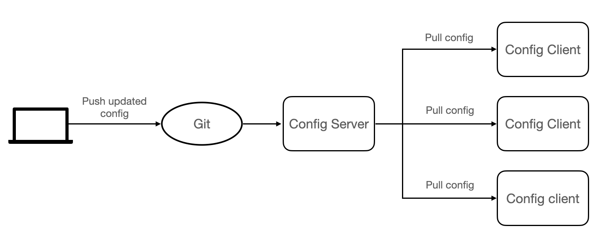

### 9.1 What is Spring Cloud Config

Spring Cloud Config is a module developed by the Spring Cloud team, which can provide centralized external configuration support for each microservice in the microservice architecture.

To put it simply, Spring Cloud Config can centrally store the configuration files of each microservice in an external storage warehouse or system (such as Git, SVN, etc.), and expose the configurations through REST API to support the operation of each microservice.

Spring Cloud Config consists of the following two parts:

* Config Server: Also known as the distributed configuration center, it is a microservice application that runs independently, used to connect to the configuration warehouse and provide clients with access interfaces to obtain configuration information, encrypted information, and decrypted information.
* Config Client: Refers to each microservice in the microservice architecture, which manages the configuration through the Config Server, and obtains and loads configuration information from the Config Server.

Spring Cloud Config uses Git to store configuration information by default.


### 9.2 How Spring Cloud Config works

The working principle of Spring Cloud Config is as follows:



The Spring Cloud Config workflow is as follows:

1. The developer or maintainer submit the configuration file to the remote Git repository.
2. The Config server (distributed configuration center) is responsible for connecting to the configuration warehouse Git, and exposing the interface for obtaining configuration to the Config client.
3. The Config client pulls the configuration in the configuration repository through the interface exposed by the Config server.
4. Config client obtains configuration information.


### 9.3 Set up a Config Server

(1) Create a repository (Repository) named springcloud-config on Github and get the address of the repository.

(2) Under parent project “DataEngineSwarm”, create a module named as micro-service-cloud-config-center-3344\. Add dependency to pom.xml as follows:

```xml
<?xml version="1.0" encoding="UTF-8"?>
<project xmlns="http://maven.apache.org/POM/4.0.0" xmlns:xsi="http://www.w3.org/2001/XMLSchema-instance"
         xsi:schemaLocation="http://maven.apache.org/POM/4.0.0 https://maven.apache.org/xsd/maven-4.0.0.xsd">
    <modelVersion>4.0.0</modelVersion>
    <parent>
        <artifactId>DataEngineSwarm</artifactId>
        <groupId>com.luxbp</groupId>
        <version>0.0.1-SNAPSHOT</version>
    </parent>
    <groupId>com.luxbp/groupId>
    <artifactId>micro-service-cloud-config-center-3344</artifactId>
    <version>0.0.1-SNAPSHOT</version>
    <name>micro-service-cloud-config-center-3344</name>
    <description>Demo project for Spring Boot</description>
    <properties>
        <java.version>1.8</java.version>
    </properties>
    <dependencies>
        <dependency>
            <groupId>org.springframework.boot</groupId>
            <artifactId>spring-boot-starter</artifactId>
        </dependency>
        <dependency>
            <groupId>org.springframework.boot</groupId>
            <artifactId>spring-boot-starter-test</artifactId>
            <scope>test</scope>
        </dependency>
        <!--dependency of config center-->
        <dependency>
            <groupId>org.springframework.cloud</groupId>
            <artifactId>spring-cloud-config-server</artifactId>
        </dependency>
        <dependency>
            <groupId>org.springframework.boot</groupId>
            <artifactId>spring-boot-starter-web</artifactId>
        </dependency>
        <dependency>
            <groupId>org.springframework.cloud</groupId>
            <artifactId>spring-cloud-starter-netflix-eureka-client</artifactId>
        </dependency>
    </dependencies>
    <build>
        <plugins>
            <plugin>
                <groupId>org.springframework.boot</groupId>
                <artifactId>spring-boot-maven-plugin</artifactId>
            </plugin>
        </plugins>
    </build>
</project>
```

(3) Under /resources, create the configuration file “application.yml”, the content is as follows:

```yaml
server:
  port: 3344 #port
spring:
  application:
    name: spring-cloud-config-center # service name
  cloud:
    config:
      server:
        git:
          uri: https://github.com/dustwh/springcloud-config.git # this where we put config file
          # repo name
          search-paths:
            - springcloud-config
          force-pull: true
          # if Git Repo is piblic，then no need for username and password, othervice,username and password is needed.
          # username: ********
          # password: ********
      #branch name
      label: main
eureka:
  client: #register client to eureka list
    service-url:
      defaultZone: http://eureka7001.com:7001/eureka/,http://eureka7002.com:7002/eureka/,http://eureka7003.com:7003/eureka/  #register into cluster
management:
  endpoints:
    web:
      exposure:
        include: 'bus-refresh'
```

(4) On the main startup class of micro-service-cloud-config-center-3344, use the @EnableConfigServer annotation to enable the Spring Cloud Config configuration center function, the code is as follows.

```java
package com.luxbp;

import org.springframework.boot.SpringApplication;
import org.springframework.boot.autoconfigure.SpringBootApplication;
import org.springframework.cloud.config.server.EnableConfigServer;
import org.springframework.cloud.netflix.eureka.EnableEurekaClient;

@SpringBootApplication
@EnableEurekaClient
@EnableConfigServer
public class MicroServiceCloudConfigCenter3344Application {

    public static void main(String[] args) {
        SpringApplication.run(MicroServiceCloudConfigCenter3344Application.class, args);
    }

}

```

(5) Create a new file named config-dev.yml and upload it to the main branch of the springcloud-config warehouse. The content of config-dev.yml is as follows.

```yaml
config:
  info: com.luxbp engin
  version: 0.0.1
```

(6) Run Eureka cluster and micro-service-cloud-config-center-3344, visit “http://localhost:3344/master/config-dev.yml”, result is as follows:


(7) modify configuration file access rule:

Spring Cloud Config specifies a set of configuration file access rules, as shown in the following table:

    access rules show case    /{application}/{profile}[/{label}]  /config/dev/master    /{application}-{profile}.{suffix}  /config-dev.yml    /{label}/{application}-{profile}.{suffix}  /main/config-dev.yml   The parameters in the access rules are described as follows:

* {application}: Application name, that is, the name of the configuration file, such as config-dev.
* {profile}: Environment name. A project usually has a development (dev) version, a test (test) environment version, and a production (prod) environment version. The configuration file is distinguished in the form of application-{profile}.yml, such as application -dev.yml, application-test.yml, application-prod.yml, etc.
* {label}: Git branch name, the default is the master branch. When accessing the configuration file under the default branch, this parameter can be omitted, which is the second access method.
* {suffix}: The suffix of the configuration file, for example, the suffix of config-dev.yml is yml.

Through this set of rules, we can directly access the configuration file on the browser.

For example, through configuring correct access rule, we can access the config file by visit the url like ”http://localhost:3344/config-dev.yml” / “http://localhost:3344/config/dev/master”.


### 9.4 Set up a Config Client

(1). Under the parent project DataEngineSwarm, create a Spring Boot module named micro-service-cloud-config-client-3355, and add Spring Cloud Config client dependencies to its pom.xml. The configuration content is as follows .

```xml
<?xml version="1.0" encoding="UTF-8"?>
<project xmlns="http://maven.apache.org/POM/4.0.0" xmlns:xsi="http://www.w3.org/2001/XMLSchema-instance"
         xsi:schemaLocation="http://maven.apache.org/POM/4.0.0 https://maven.apache.org/xsd/maven-4.0.0.xsd">
    <modelVersion>4.0.0</modelVersion>
    <parent>
        <artifactId>DataEngineSwarm</artifactId>
        <groupId>com.luxbp</groupId>
        <version>0.0.1-SNAPSHOT</version>
    </parent>
    <groupId>com.luxbp</groupId>
    <artifactId>micro-service-cloud-config-client-3355</artifactId>
    <version>0.0.1-SNAPSHOT</version>
    <name>micro-service-cloud-config-client-3355</name>
    <description>Demo project for Spring Boot</description>
    <properties>
        <java.version>1.8</java.version>
    </properties>
    <dependencies>
        <dependency>
            <groupId>org.springframework.boot</groupId>
            <artifactId>spring-boot-starter-web</artifactId>
        </dependency>
        <dependency>
            <groupId>org.springframework.boot</groupId>
            <artifactId>spring-boot-devtools</artifactId>
            <scope>runtime</scope>
            <optional>true</optional>
        </dependency>
        <dependency>
            <groupId>org.projectlombok</groupId>
            <artifactId>lombok</artifactId>
            <optional>true</optional>
        </dependency>
        <dependency>
            <groupId>org.springframework.boot</groupId>
            <artifactId>spring-boot-starter-test</artifactId>
            <scope>test</scope>
        </dependency>
        <dependency>
            <groupId>org.springframework.cloud</groupId>
            <artifactId>spring-cloud-starter-config</artifactId>
        </dependency>
        <dependency>
            <groupId>org.springframework.cloud</groupId>
            <artifactId>spring-cloud-starter-netflix-eureka-client</artifactId>
        </dependency>
    </dependencies>
    <build>
        <plugins>
            <plugin>
                <groupId>org.springframework.boot</groupId>
                <artifactId>spring-boot-maven-plugin</artifactId>
                <configuration>
                    <excludes>
                        <exclude>
                            <groupId>org.projectlombok</groupId>
                            <artifactId>lombok</artifactId>
                        </exclude>
                    </excludes>
                </configuration>
            </plugin>
        </plugins>
    </build>
</project>
```

(2). Under the classpath (/resources directory) in micro-service-cloud-config-client-3355, create a configuration file named bootstrap.yml, the configuration is as follows.

```yaml
#bootstrap.yml is at system level，loading order is prior to application.yml   Responsible for loading configuration from outside and parsing
server:
  port: 3355
spring:
  application:
    name: spring-cloud-config-client
  cloud:
    config:
      label: main #branch name
      name: config  #name of the config file, the 'config' in 'config-dev.yml'
      profile: dev  #environment name, 'dev'  'config-dev.yml'
      #don't forget to add http here. Otherwise it won't load.
      uri: http://localhost:3344 #address of Spring Cloud Config server end
eureka:
  client:
    service-url:
      defaultZone: http://eureka7001.com:7001/eureka/,http://eureka7002.com:7002/eureka/,http://eureka7003.com:7003/eureka/
# Spring Boot 2.50 screens most of the nodes for actuator monitoring, and only exposes the health node. The configuration (*) in this section is to enable all nodes
management:
  endpoints:
    web:
      exposure:
        include: "*"   # * is a keyword in the yaml file, so quotation marks are required
```

(3) Under the controller package, create a class named ConfigClientController to obtain the configuration in the configuration file through this class, the code is as follows.

```java
package com.luxbp.controller;
import org.springframework.beans.factory.annotation.Value;
import org.springframework.web.bind.annotation.GetMapping;
import org.springframework.web.bind.annotation.RestController;
//Read the content of the specified configuration file in the configuration center and display it on the page
@RestController
public class ConfigClientController {
    @Value("${server.port}")
    private String serverPort;
    @Value("${config.info}")
    private String configInfo;
    @Value("${config.version}")
    private String configVersion;
    @GetMapping(value = "/getConfig")
    public String getConfig() {
        return "info：" + configInfo + "<br/>version：" + configVersion + "<br/>port：" + serverPort;
    }
}
```

(4) On the main startup class of micro-service-cloud-config-client-3355, use the @EnableEurekaClient annotation to enable the Eureka client function, the code is as follows.

```java
package com.luxbp;
import org.springframework.boot.SpringApplication;
import org.springframework.boot.autoconfigure.SpringBootApplication;
import org.springframework.cloud.netflix.eureka.EnableEurekaClient;
@SpringBootApplication
@EnableEurekaClient
public class MicroServiceCloudConfigClient3355Application {
    public static void main(String[] args) {
        SpringApplication.run(MicroServiceCloudConfigClient3355Application.class, args);
    }
}
```

(5). Start micro-service-cloud-config-client-3355, use a browser to access "<http://localhost:3355/getConfig>", the result is as shown below.


(6). Change the value of config.version in the configuration file config-dev.yml to 2.0, the configuration is as follows.

```yaml
config:
  info: com.luxbp engin
  version: 0.0.2
```

(7). Start the Eureka service registry (cluster) and micro-service-cloud-config-center-3344 in sequence, and use a browser to access "<http://localhost:3344/master/config-dev.yml>", the result is as shown in the figure below.


It can be seen from the figure that the configuration center has successfully obtained the modified configuration.

(8). Visit "<http://localhost:3355/getConfig>" again, and try to obtain the modified configuration information through the Spring Cloud Config client. The result is as shown in the figure below.


(9). Restart micro-service-cloud-config-client-3355, and access "<http://localhost:3355/getConfig>" again, the result is as shown below


Through this example, we can get the following two conclusions:

1. After the configuration is updated, the Spring Cloud Config server (Server) can get the latest configuration directly from the Git repository.
2. Unless the Spring Cloud Config client (Client) is restarted, the latest configuration information cannot be obtained through the Spring Cloud Config server.