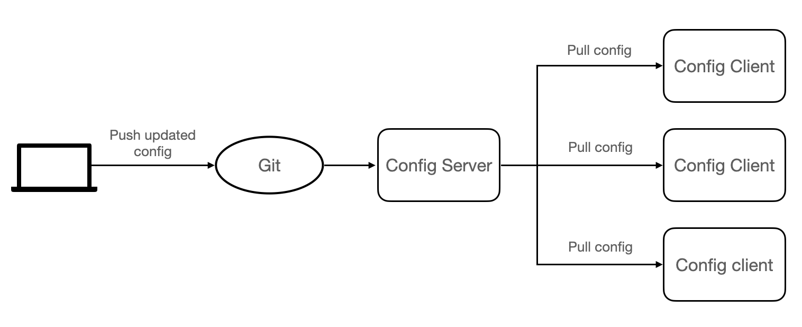
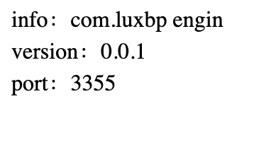

### 3.1 What is Spring Cloud Config

Spring Cloud Config is a module developed by the Spring Cloud team, which can provide centralized external configuration support for each microservice in the microservice architecture.

To put it simply, Spring Cloud Config can centrally store the configuration files of each microservice in an external storage warehouse or system (such as Git, SVN, etc.), and expose the configurations through REST API to support the operation of each microservice.

Spring Cloud Config consists of the following two parts:

* Config Server: Also known as the distributed configuration center, it is a microservice application that runs independently, used to connect to the configuration warehouse and provide clients with access interfaces to obtain configuration information, encrypted information, and decrypted information.
* Config Client: Refers to each microservice in the microservice architecture, which manages the configuration through the Config Server, and obtains and loads configuration information from the Config Server.

Spring Cloud Config uses Git to store configuration information by default.


### 3.2 How Spring Cloud Config works

The working principle of Spring Cloud Config is as follows:



The Spring Cloud Config workflow is as follows:

1. The developer or maintainer submit the configuration file to the remote Git repository.
2. The Config server (distributed configuration center) is responsible for connecting to the configuration warehouse Git, and exposing the interface for obtaining configuration to the Config client.
3. The Config client pulls the configuration in the configuration repository through the interface exposed by the Config server.
4. Config client obtains configuration information.


### 3.3 Set up a Config Server

(1) Create a repository (Repository) named springcloud-config on Github and get the address of the repository.

(2) Under parent project “DataEngineSwarm”, create a module named as micro-service-cloud-config-center-3344\. Add dependency to pom.xml as follows:

```xml
<?xml version="1.0" encoding="UTF-8"?>
<project xmlns="http://maven.apache.org/POM/4.0.0" xmlns:xsi="http://www.w3.org/2001/XMLSchema-instance"
         xsi:schemaLocation="http://maven.apache.org/POM/4.0.0 https://maven.apache.org/xsd/maven-4.0.0.xsd">
    <modelVersion>4.0.0</modelVersion>
    <parent>
        <artifactId>DataEngineSwarm</artifactId>
        <groupId>com.luxbp</groupId>
        <version>0.0.1-SNAPSHOT</version>
    </parent>
    <groupId>com.luxbp/groupId>
    <artifactId>micro-service-cloud-config-center-3344</artifactId>
    <version>0.0.1-SNAPSHOT</version>
    <name>micro-service-cloud-config-center-3344</name>
    <description>Demo project for Spring Boot</description>
    <properties>
        <java.version>1.8</java.version>
    </properties>
    <dependencies>
        <dependency>
            <groupId>org.springframework.boot</groupId>
            <artifactId>spring-boot-starter</artifactId>
        </dependency>
        <dependency>
            <groupId>org.springframework.boot</groupId>
            <artifactId>spring-boot-starter-test</artifactId>
            <scope>test</scope>
        </dependency>
        <!--dependency of config center-->
        <dependency>
            <groupId>org.springframework.cloud</groupId>
            <artifactId>spring-cloud-config-server</artifactId>
        </dependency>
        <dependency>
            <groupId>org.springframework.boot</groupId>
            <artifactId>spring-boot-starter-web</artifactId>
        </dependency>
        <dependency>
            <groupId>org.springframework.cloud</groupId>
            <artifactId>spring-cloud-starter-netflix-eureka-client</artifactId>
        </dependency>
    </dependencies>
    <build>
        <plugins>
            <plugin>
                <groupId>org.springframework.boot</groupId>
                <artifactId>spring-boot-maven-plugin</artifactId>
            </plugin>
        </plugins>
    </build>
</project>
```

(3) Under /resources, create the configuration file “application.yml”, the content is as follows:

```yaml
server:
  port: 3344 #port
spring:
  application:
    name: spring-cloud-config-center # service name
  cloud:
    config:
      server:
        git:
          uri: https://github.com/dustwh/springcloud-config.git # this where we put config file
          # repo name
          search-paths:
            - springcloud-config
          force-pull: true
          # if Git Repo is piblic，then no need for username and password, othervice,username and password is needed.
          # username: ********
          # password: ********
      #branch name
      label: main
eureka:
  client: #register client to eureka list
    service-url:
      defaultZone: http://eureka7001.com:7001/eureka/,http://eureka7002.com:7002/eureka/,http://eureka7003.com:7003/eureka/  #register into cluster
management:
  endpoints:
    web:
      exposure:
        include: 'bus-refresh'
```

(4) On the main startup class of micro-service-cloud-config-center-3344, use the @EnableConfigServer annotation to enable the Spring Cloud Config configuration center function, the code is as follows.

```java
package com.luxbp;

import org.springframework.boot.SpringApplication;
import org.springframework.boot.autoconfigure.SpringBootApplication;
import org.springframework.cloud.config.server.EnableConfigServer;
import org.springframework.cloud.netflix.eureka.EnableEurekaClient;

@SpringBootApplication
@EnableEurekaClient
@EnableConfigServer
public class MicroServiceCloudConfigCenter3344Application {

    public static void main(String[] args) {
        SpringApplication.run(MicroServiceCloudConfigCenter3344Application.class, args);
    }

}

```

(5) Create a new file named config-dev.yml and upload it to the main branch of the springcloud-config warehouse. The content of config-dev.yml is as follows.

```yaml
config:
  info: com.luxbp engin
  version: 0.0.1
```

(6) Run Eureka cluster and micro-service-cloud-config-center-3344, visit “http://localhost:3344/master/config-dev.yml”, result is as follows:



(7) modify configuration file access rule


### 3.4 Set up a Config Client


### 3.5 Get updated config file by manually refresh


### 3.5 Get updated config file by dynamic refresh using Config+Bus